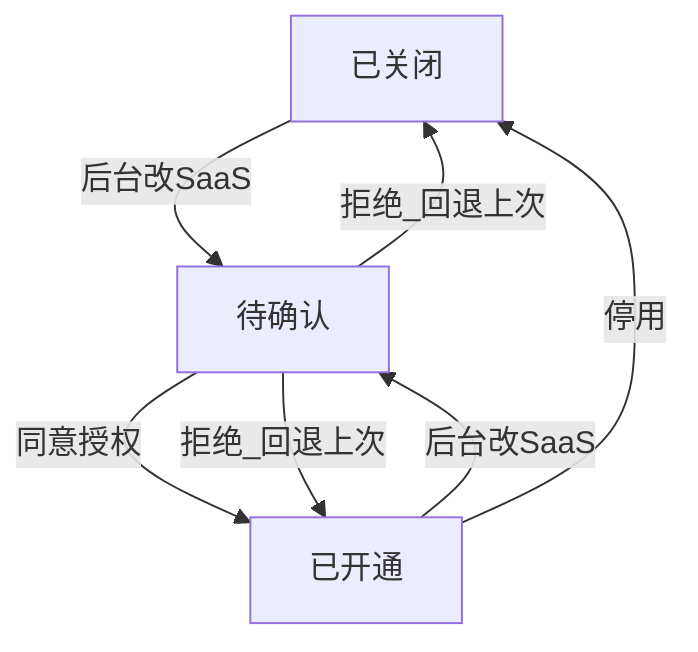
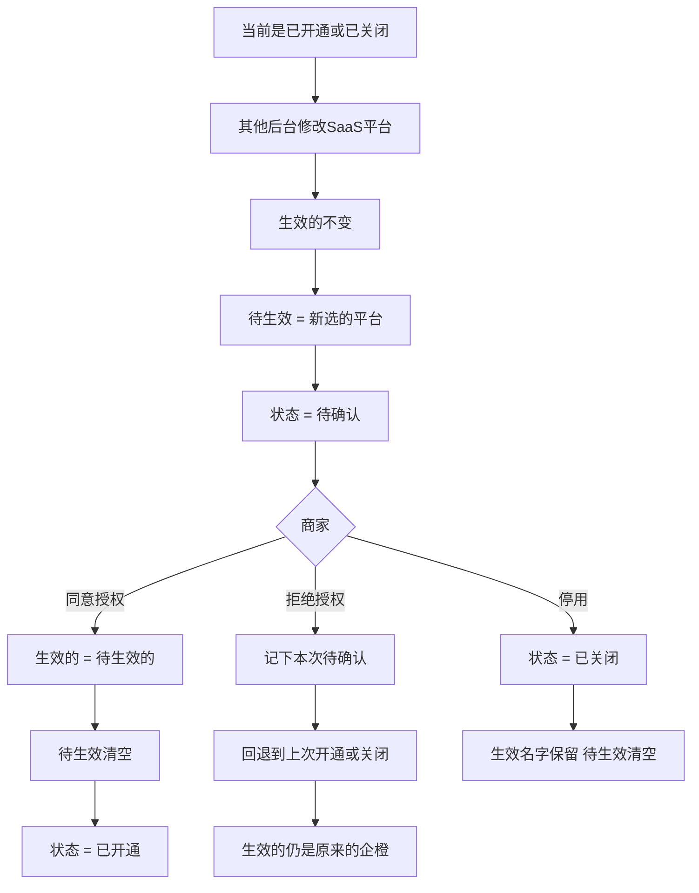
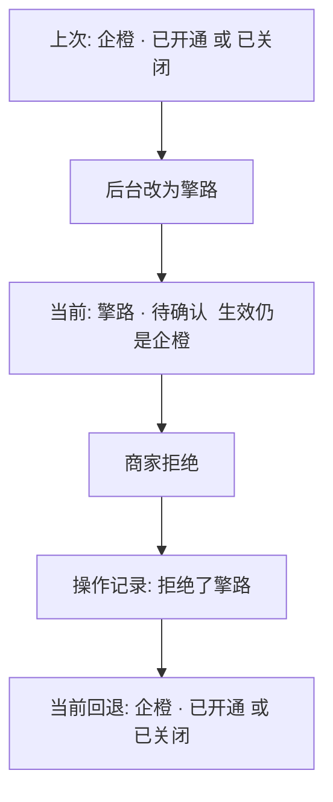
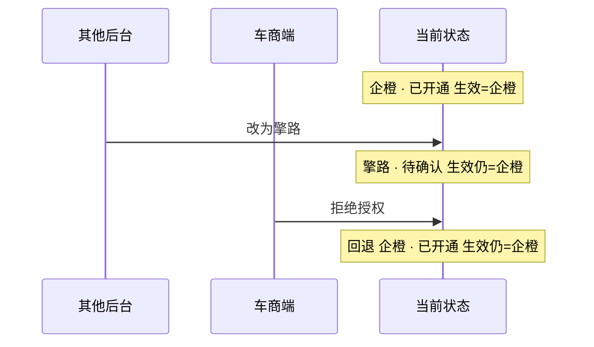

# SaaS 库存同步授权 — 流程与逻辑

按企业看当前配置。企业身份不变。  
当前同时有两套服务商：**生效的**（正在用）和 **待生效的**（后台刚改、还没确认）。不用「原 / 新」。

操作（后台修改、同意、拒绝、停用）先记下当时的状态，再改当前。拒绝时按 **上次开通 / 关闭** 回退。

---

## 1. 状态

| 值 | 当前看到的 | 含义 |
| --- | --- | --- |
| 0 | 已关闭 / 未开通 | 停用后，或从未走过确认 |
| 1 | 已开通 | 商家确认授权后 |
| 2 | 待确认 | 后台改了 SaaS，等商家处理 |
| 3 | 当前不展示 | 只表示「这次拒绝了待生效平台」，留在操作记录里 |

未开通：没有生效服务商，展示「无」。  
已关闭：还有上次生效的名字，展示「企橙 · 已关闭」。

---

## 2. 列表怎么展示

库存同步只跟 **生效的服务商** 走。

| 当前状态 | 名称用谁 | 文案 |
| --- | --- | --- |
| 已开通 | 生效的 | 已开通 |
| 已关闭 / 未开通 | 生效的（没有则「无」） | 已关闭 / 未开通 |
| 待确认 | 待生效的 | 待确认 |

拒绝后当前立刻回到开通或关闭，列表是「企橙 · 已开通」或「企橙 · 已关闭」，不停在「擎路 · 已拒绝」。拒了谁只在操作记录里查。

确认弹窗：生效的 = 现在在用的；待生效的 = 这次要确认的。

---

## 3. 状态流转

当前只有：已关闭、已开通、待确认。  
已关闭和已开通一样：后台再改 SaaS，都进入待确认。只有待确认才能同意或拒绝。

拒绝回到关闭还是开通，看进入待确认之前是什么：上次关闭仍关闭，上次开通仍开通。

---

## 4. 各动作在做什么

要点：后台改平台只动待生效，不动生效。同意才把待生效晋升为生效。拒绝不把擎路写成生效。

---

## 5. 拒绝如何回退文案

拒绝 = 先记下「这次拒了待生效的擎路」，再把当前恢复成 **进入这轮待确认之前** 的开通 / 关闭。

- 上次已开通 → 拒绝后仍是 **企橙 · 已开通**
- 上次已关闭 → 拒绝后仍是 **企橙 · 已关闭**
- 从未开通过就拒绝 → **无 · 未开通**
- 不回退到「已拒绝」

---

## 6. 场景

### 已开通后改擎路再拒绝

同步一直走企橙。列表拒绝后也回到企橙已开通。

### 已关闭后改擎路再拒绝

同上，只是头尾都是 **企橙 · 已关闭**。擎路从未生效。

### 同意授权

待确认时同意：生效换成待生效的平台，待生效清空，状态变成已开通。  
例如待确认是擎路 → 同意后 **擎路 · 已开通**，之后同步走擎路。

---

## 7. 当前状态里要有的信息

按企业一份即可，身份用企业 id，不换。

| 信息 | 作用 |
| --- | --- |
| 企业 | 定位这一户 |
| 生效的服务商 | 同步用；开通 / 关闭时列表用 |
| 待生效的服务商 | 待确认时列表和弹窗用 |
| 确认状态 | 0 / 1 / 2 |
| 操作记录 | 改之前的整份状态 + 同意 / 拒绝 / 停用 / 后台修改；拒绝回退时读上次开通或关闭 |
